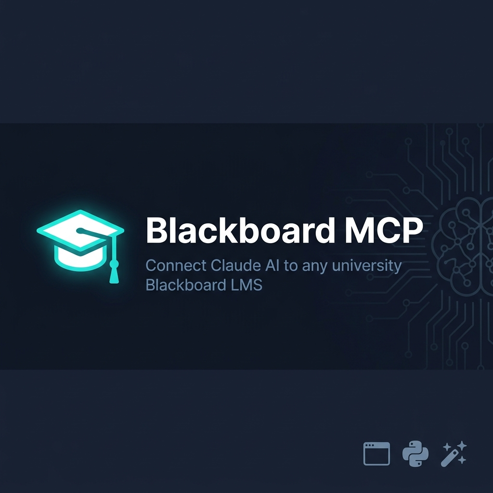

<p align="center">
  
</p>

<p align="center">
  <a href="https://www.python.org/downloads/"></a>
  <a href="LICENSE"></a>
  <a href="https://modelcontextprotocol.io"></a>
  
  
</p>

<p align="center">
  <b>Talk to your university Blackboard in plain English — through Claude AI.</b><br>
  Works with <em>any</em> university that uses Blackboard Learn (Ultra or Classic).
</p>

---

## 🧠 Install with AI (one prompt)

If you're using **Claude Code, Cursor, or Windsurf**, just paste this prompt and the AI installs everything for you:

```
Install the Blackboard MCP server for me from https://github.com/sasindudilshanranwadana/blackboard-mcp

Run this in the terminal:
  curl -fsSL https://raw.githubusercontent.com/sasindudilshanranwadana/blackboard-mcp/main/install.sh | bash

Wait for it to finish (it opens a browser for me to log in). Then tell me what was configured and how to test it.
```

See [INSTALL_PROMPTS.md](INSTALL_PROMPTS.md) for prompts for every AI coding assistant.

## ✨ What is this?

**Blackboard MCP** is a [Model Context Protocol](https://modelcontextprotocol.io) server that bridges Claude AI with your university's Blackboard LMS. Instead of navigating menus and dashboards, just ask Claude:

> *"What assignments are due this week?"*
> *"Catch me up on all announcements from my courses"*
> *"What's my current grade in Database Concepts?"*

No Blackboard API key or admin approval needed. Authentication uses your existing student login through a real browser — works with any SSO provider (Microsoft, Shibboleth, Google, and more).

---

## 🚀 Features

| Tool | What you can ask |
|------|-----------------|
| `get_my_profile` | *"Who am I logged in as?"* |
| `list_courses` | *"What courses am I enrolled in?"* |
| `get_course_details` | *"Tell me about my Software Systems unit"* |
| `get_announcements` | *"Any new announcements from my lecturers?"* |
| `get_assignments` | *"List all my assignments"* |
| `get_due_dates` | *"What's due in the next 2 weeks?"* |
| `get_grades` | *"What are my current grades?"* |
| `get_course_content` | *"What content is in my Database course?"* |
| `summarize_activity` | *"Give me a full catch-up on everything"* |

---

## 🎓 Compatibility

Works with **any university** running Blackboard Learn:

- ✅ **Blackboard Ultra** (modern interface)
- ✅ **Blackboard Classic** (legacy interface)
- ✅ **Any SSO provider** — Microsoft ADFS, Shibboleth, Google, CAS, or custom

The setup wizard auto-detects your university's interface and handles authentication through a real browser window — no special configuration needed.

> **Built at Charles Darwin University (CDU)** — but designed to work anywhere.

---

## ⚡ Quick Start

### Option A — One-shot installer (recommended)

Paste this into your terminal. That's it.

```bash
curl -fsSL https://raw.githubusercontent.com/sasindudilshanranwadana/blackboard-mcp/main/install.sh | bash
```

The installer will:
1. Check Python 3.11+ and git are available
2. Clone the repo to `~/blackboard-mcp`
3. Create a virtual environment and install all dependencies
4. Download Playwright's Chromium browser
5. Launch the setup wizard → browser opens → log in → done

---

### Option B — Manual install

git clone https://github.com/sasindudilshanranwadana/blackboard-mcp.git
cd blackboard-mcp
pip install -r requirements.txt
playwright install chromium
```

### 2 — Run the setup wizard

```bash
python3 setup.py
```

The wizard will:
1. Ask for your university's Blackboard URL (e.g. `https://blackboard.myuni.edu.au`)
2. Auto-detect Ultra vs Classic interface
3. Open a browser — log in as you normally would
4. Test your connection and list your courses
5. Optionally save credentials to macOS Keychain for auto-relogin
6. Automatically configure Claude Desktop

### 3 — Restart Claude Desktop and ask away

```
"What courses am I enrolled in?"
"What assignments are due this week?"
"Catch me up on everything in Blackboard"
```

---

## 🔐 Authentication

This project uses a **zero-credentials-stored** approach by default:

1. **Interactive browser login** — A real browser opens, you log in exactly as you would on the Blackboard website. Works with any SSO, MFA, or CAPTCHA.
2. **Session cookie caching** — Your session is cached at `~/.bb_mcp_session.json` (outside the project, never committed).
3. **Optional macOS Keychain** — For automatic re-login when sessions expire, credentials can be saved securely in macOS Keychain (never in any file).

```
Your credentials → macOS Keychain (encrypted, OS-managed)
Your session    → ~/.bb_mcp_session.json (your home dir, not the repo)
This repo       → Zero sensitive data
```

---

## 🏗️ Architecture

```
Claude Desktop
     │  MCP (stdio)
     ▼
 server.py          ← FastMCP server, 9 tools registered
     │
     ▼
 blackboard/
 ├── client.py      ← HTTP client: REST API + HTML scraping fallback
 ├── auth.py        ← Playwright SSO login + Keychain + cookie cache
 └── models.py      ← Pydantic data models

 config.py          ← Settings loaded from .env (URL, interface)
 setup.py           ← One-command interactive setup wizard
```

**Data flow per tool call:**
```
Claude asks → MCP tool → check cached cookies → REST API request
                                  │                      │
                           expired? → re-login      scraping fallback
                                         │
                              browser (if needed)
```

---

## 🛠️ Manual Configuration

If you prefer to configure manually instead of using the wizard, create a `.env` file:

```ini
BB_BASE_URL=https://blackboard.myuni.edu.au
BB_INTERFACE=ultra        # or: classic
BB_SESSION_CACHE=~/.bb_mcp_session.json
```

Then add to your Claude Desktop config (`~/Library/Application Support/Claude/claude_desktop_config.json`):

```json
{
  "mcpServers": {
    "blackboard": {
      "command": "python3",
      "args": ["/path/to/blackboard-mcp/server.py"],
      "cwd": "/path/to/blackboard-mcp"
    }
  }
}
```

---

## 🔄 Session Management

| Scenario | What happens |
|----------|-------------|
| First run | `setup.py` opens browser → you log in → cookies cached |
| Server restart | Cached cookies reused automatically |
| Session expired + Keychain set | Auto re-login headlessly |
| Session expired + no Keychain | Re-run `python3 setup.py` |
| Reset everything | `python3 setup.py --reset` |

---

## 🤝 Contributing

Contributions are welcome! If your university's Blackboard works differently or you hit an issue:

1. Fork the repo
2. Create a branch: `git checkout -b fix/my-university`
3. Make your changes
4. Open a Pull Request — please include your university name and Blackboard version

See [CONTRIBUTING.md](CONTRIBUTING.md) for details.

---

## 📋 Troubleshooting

**Browser keeps opening and closing**
> Your session expired. Run `python3 setup.py` to re-authenticate.

**"No courses found"**
> The REST API may be restricted at your university. The client will fall back to HTML scraping — try `get_course_content` directly.

**MCP server not showing in Claude Desktop**
> Fully quit Claude Desktop (Cmd+Q) and reopen it. Check your config with:
> `cat ~/Library/Application\ Support/Claude/claude_desktop_config.json`

**SSO / MFA issues**
> Make sure `BB_INTERFACE` in `.env` matches your university's Blackboard version. Run `python3 setup.py` again if unsure.

---

## 📄 License

MIT — see [LICENSE](LICENSE).

---

<p align="center">
  Made with ❤️ by a student, for students.<br>
  <a href="https://github.com/sasindudilshanranwadana/blackboard-mcp/issues">Report an Issue</a> · 
  <a href="https://github.com/sasindudilshanranwadana/blackboard-mcp/discussions">Discussions</a>
</p>
