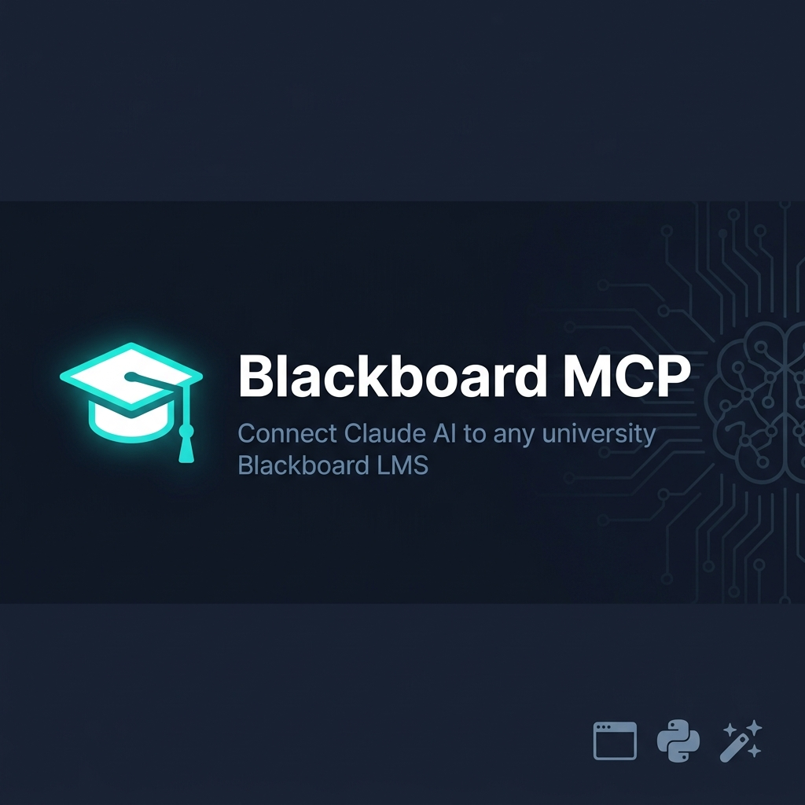

<p align="center">
  
</p>

<p align="center">
  <a href="https://www.python.org/downloads/"></a>
  <a href="LICENSE"></a>
  <a href="https://modelcontextprotocol.io"></a>
  
  
  
</p>

<p align="center">
  <b>Talk to your university Blackboard in plain English — through any AI assistant.</b><br>
  Works with <em>any</em> university that uses Blackboard Learn (Ultra or Classic).
</p>

---

## 🧠 Install with AI (one prompt)

Works with **Claude Desktop, Claude Code, Cursor, Windsurf, Cline, Zed, Continue, Codex CLI, Gemini CLI** — paste the right prompt and the AI installs everything for you:

```
Install the Blackboard MCP server for me from https://github.com/sasindudilshanranwadana/blackboard-mcp

Run this in the terminal:
  curl -fsSL https://raw.githubusercontent.com/sasindudilshanranwadana/blackboard-mcp/main/install.sh | bash

Wait for it to finish (it opens a browser for me to log in). Then tell me what was configured and how to test it.
```

See [INSTALL_PROMPTS.md](INSTALL_PROMPTS.md) for a ready-made prompt for every AI platform.

## ✨ What is this?

**Blackboard MCP** is a [Model Context Protocol](https://modelcontextprotocol.io) server that connects any AI coding assistant to your university's Blackboard LMS. Instead of navigating menus and dashboards, just ask your AI:

> *"What assignments are due this week?"*
> *"Catch me up on all announcements from my courses"*
> *"What's my current grade in Database Concepts?"*

**Works at any university** that runs Blackboard Learn — not just one institution. No Blackboard API key or admin approval needed. Authentication uses your existing student login through a real browser, supporting any SSO provider (Microsoft, Shibboleth, Google, and more).

### First-time setup takes 30 seconds

After installing, just tell your AI assistant:

> *"Connect my Blackboard — my university URL is https://blackboard.myuniversity.edu"*

A browser opens, you log in as normal, and you're done. The AI guides you through everything — no terminal commands needed.

---

## 🚀 Features

| Tool | What you can ask |
|------|-----------------|
| `connect_blackboard` | *"Connect my Blackboard — my university URL is https://..."* |
| `get_my_profile` | *"Who am I logged in as?"* |
| `list_courses` | *"What courses am I enrolled in?"* |
| `get_course_details` | *"Tell me about my Software Systems unit"* |
| `get_announcements` | *"Any new announcements from my lecturers?"* |
| `get_assignments` | *"List all my assignments"* |
| `get_due_dates` | *"What's due in the next 2 weeks?"* |
| `get_grades` | *"What are my current grades?"* |
| `get_course_content` | *"What content is in my Database course?"* |
| `summarize_activity` | *"Give me a full catch-up on everything"* |

---

## 🎓 Compatibility

### AI coding platforms

| Platform | Auto-configured | Config location |
|----------|:--------------:|-----------------|
| **Claude Desktop** | ✅ | `~/Library/Application Support/Claude/claude_desktop_config.json` |
| **Claude Code** | ✅ | `~/.claude/claude_desktop_config.json` |
| **Cursor** | ✅ | `~/.cursor/mcp.json` |
| **Windsurf** | ✅ | `~/.codeium/windsurf/mcp_config.json` |
| **Cline** (VS Code) | ✅ | VS Code globalStorage |
| **Zed** | ✅ | `~/.config/zed/settings.json` |
| **Continue** | ✅ | `~/.continue/config.json` |
| **Codex CLI** | ✅ | `~/.codex/config.json` |
| **Gemini CLI** | ✅ | `~/.gemini/settings.json` |
| Any MCP-compatible tool | Manual | See [INSTALL_PROMPTS.md](INSTALL_PROMPTS.md) |

### Blackboard interface

- ✅ **Blackboard Ultra** (modern interface)
- ✅ **Blackboard Classic** (legacy interface)
- ✅ **Any SSO provider** — Microsoft ADFS, Shibboleth, Google, CAS, or custom

The setup wizard auto-detects your university's interface and handles authentication through a real browser window — no special configuration needed.

> **Built at Charles Darwin University (CDU)** — but designed to work anywhere.

---

## ⚡ Quick Start

### Step 1 — Install (one command)

```bash
curl -fsSL https://raw.githubusercontent.com/sasindudilshanranwadana/blackboard-mcp/main/install.sh | bash
```

The installer automatically:
1. Checks Python 3.11+ and git are available
2. Clones the repo to `~/blackboard-mcp`
3. Creates a virtual environment and installs all dependencies
4. Downloads Playwright's Chromium browser
5. Detects and configures all your AI assistants (Claude Desktop, Cursor, Windsurf, Cline, Zed, Continue, and more)

### Step 2 — Connect your Blackboard (no terminal needed)

Restart your AI assistant, then just say:

> *"Connect my Blackboard — my university URL is https://blackboard.myuniversity.edu"*

A browser opens → log in with your normal university credentials → done. The AI handles everything from there.

> **Can't find your university's URL?** It's usually on your university website under "Student Portal", "LMS", or "Learnline". It looks like `https://blackboard.myuniversity.edu` or `https://learn.myuni.edu.au`.

### Step 3 — Ask anything

```
"What courses am I enrolled in?"
"What assignments are due this week?"
"Catch me up on everything in Blackboard"
```

---

### Alternative: terminal setup wizard

Prefer to set everything up in one go from the terminal:

---

```bash
python3 setup.py
```

The wizard will:
1. Ask for your university's Blackboard URL
2. Auto-detect Ultra vs Classic interface
3. Open a browser — log in as you normally would (works with any SSO or MFA)
4. Test your connection and list your courses
5. Optionally save credentials to your OS keychain for silent auto-relogin
6. Automatically configure all detected AI assistants

### Manual install (advanced)

```bash
git clone https://github.com/sasindudilshanranwadana/blackboard-mcp.git
cd blackboard-mcp
pip install -r requirements.txt
playwright install chromium
python3 setup.py
```

---

## 🔐 Authentication

This project uses a **zero-credentials-stored** approach by default:

1. **Interactive browser login** — A real browser opens, you log in exactly as you would on the Blackboard website. Works with any SSO, MFA, or CAPTCHA.
2. **Session cookie caching** — Your session is cached at `~/.bb_mcp_session.json` (outside the project, never committed).
3. **Optional macOS Keychain** — For automatic re-login when sessions expire, credentials can be saved securely in macOS Keychain (never in any file).

```
Your credentials → macOS Keychain (encrypted, OS-managed)
Your session    → ~/.bb_mcp_session.json (your home dir, not the repo)
This repo       → Zero sensitive data
```

---

## 🏗️ Architecture

```
Claude Desktop
     │  MCP (stdio)
     ▼
 server.py          ← FastMCP server, 9 tools registered
     │
     ▼
 blackboard/
 ├── client.py      ← HTTP client: REST API + HTML scraping fallback
 ├── auth.py        ← Playwright SSO login + Keychain + cookie cache
 └── models.py      ← Pydantic data models

 config.py          ← Settings loaded from .env (URL, interface)
 setup.py           ← One-command interactive setup wizard
```

**Data flow per tool call:**
```
Claude asks → MCP tool → check cached cookies → REST API request
                                  │                      │
                           expired? → re-login      scraping fallback
                                         │
                              browser (if needed)
```

---

## 🛠️ Manual Configuration

If you prefer to configure manually instead of using the wizard, create a `.env` file:

```ini
BB_BASE_URL=https://blackboard.myuni.edu.au
BB_INTERFACE=ultra        # or: classic
BB_SESSION_CACHE=~/.bb_mcp_session.json
```

Then add to your Claude Desktop config (`~/Library/Application Support/Claude/claude_desktop_config.json`):

```json
{
  "mcpServers": {
    "blackboard": {
      "command": "python3",
      "args": ["/path/to/blackboard-mcp/server.py"],
      "cwd": "/path/to/blackboard-mcp"
    }
  }
}
```

---

## 🔄 Session Management

| Scenario | What happens |
|----------|-------------|
| First time | Tell the AI your university URL → browser opens → you log in → done |
| Server restart | Cached session reused automatically — no login needed |
| Session expired + keychain set | Silent headless re-login — no browser popup |
| Session expired + no keychain | Browser reopens automatically — just log in again |
| Switch university | *"Connect my Blackboard — my university URL is https://..."* |
| Reset everything | `python3 setup.py --reset` |

---

## 🤝 Contributing

Contributions are welcome! If your university's Blackboard works differently or you hit an issue:

1. Fork the repo
2. Create a branch: `git checkout -b fix/my-university`
3. Make your changes
4. Open a Pull Request — please include your university name and Blackboard version

See [CONTRIBUTING.md](CONTRIBUTING.md) for details.

---

## 📋 Troubleshooting

**Haven't connected yet / "Connect your Blackboard account first"**
> Tell your AI assistant: *"Connect my Blackboard — my university URL is https://blackboard.myuniversity.edu"*

**Browser keeps opening and closing / session expired**
> Just log in when the browser opens — your session will be refreshed automatically.
> Or run `python3 setup.py` to go through the full wizard again.

**"No courses found"**
> The REST API may be restricted at your university. The server falls back to HTML scraping automatically — try asking for courses again, or use `get_course_content` directly.

**MCP server not showing in your AI assistant**
> Fully quit and reopen the app. Check your config:
> ```
> cat ~/.claude/claude_desktop_config.json          # Claude Code
> cat ~/.cursor/mcp.json                            # Cursor
> cat ~/.codeium/windsurf/mcp_config.json           # Windsurf
> ```

**SSO / MFA not working**
> Make sure `BB_INTERFACE` in `.env` matches your university's Blackboard version (`ultra` or `classic`). Run `python3 setup.py` to auto-detect it.

**Wrong university connected**
> Tell your AI: *"Connect my Blackboard — my university URL is https://correct-url.edu"* — it will switch automatically.

---

## 📄 License

MIT — see [LICENSE](LICENSE).

---

<p align="center">
  Made with ❤️ by a student, for students.<br>
  <a href="https://github.com/sasindudilshanranwadana/blackboard-mcp/issues">Report an Issue</a> · 
  <a href="https://github.com/sasindudilshanranwadana/blackboard-mcp/discussions">Discussions</a>
</p>

<!-- Verified for deployment with FastMCP -->
<!-- Tier check 8 -->
